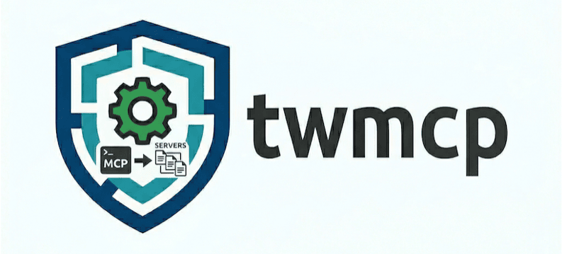

<p align="left">
  
</p>


One canonical TOML config for all your MCP servers. Compiled to agent-specific JSON.

## The Problem

AI coding agents (GitHub Copilot CLI, IntelliJ Copilot, Claude Code, Claude Desktop) each need MCP
server configurations in their own format — different JSON keys, different type names, different
header structures, different file locations. Maintaining these configs separately means:

- Duplicate definitions across 3+ JSON files
- Secrets scattered in multiple locations
- Agent-specific quirks handled manually (e.g., Claude Desktop silently ignores HTTP servers)
- Adding a server means editing every agent config

## The Solution

Define your MCP servers once in TOML. `twmcp` compiles agent-specific JSON to each agent's
expected location, handling type mappings, header formats, server compatibility, and secret
injection.

```
config.toml ──→ twmcp compile ──→ .copilot/mcp-config.json              (Copilot CLI)
                                  ~/.config/github-copilot/.../mcp.json  (IntelliJ)
                                  .claude/mcp-config.json                (Claude Code)
                                  ~/Library/.../claude_desktop_config.json(Claude Desktop)
```

## Installation

Requires Python 3.13+.

```bash
pip install twmcp
# or
uv pip install twmcp
```

## Quick Start

### 1. Create a canonical config

```bash
mkdir -p ~/.config/twmcp
```

`~/.config/twmcp/config.toml`:

```toml
env_file = "secrets.env"   # relative to config directory

[servers.github]
command = "npx"
args = ["-y", "@modelcontextprotocol/server-github"]
type = "stdio"

[servers.github.env]
GITHUB_TOKEN = "${GITHUB_TOKEN}"

[servers.github.overrides.copilot-cli]
type = "local"             # Copilot CLI calls stdio servers "local"

[servers.atlassian]
type = "http"
url = "https://mycompany.atlassian.net/mcp/"
tools = ["*"]

[servers.atlassian.headers]
Authorization = "Bearer ${CONFLUENCE_TOKEN}"

[servers.local-proxy]
command = "mcp-proxy"
args = ["http://localhost:8113/sse"]
type = "stdio"

[servers.local-proxy.env]
API_TOKEN = "${API_TOKEN:-default-token}"
```

### 2. Add your secrets

`~/.config/twmcp/secrets.env`:

```env
GITHUB_TOKEN=ghp_abc123
CONFLUENCE_TOKEN=my-confluence-token
```

Environment variables override dotenv values.

### 3. Compile

```bash
# Compile for a single agent
twmcp compile copilot-cli

# Compile for all agents
twmcp compile --all

# Preview without writing files
twmcp compile copilot-cli --dry-run

# Select specific servers interactively
twmcp compile copilot-cli --interactive

# Filter servers non-interactively
twmcp compile --all --select github,local-proxy

# Compile with no servers (empty config)
twmcp compile copilot-cli --select none
```

## What Gets Generated

From the config above, each agent receives a tailored JSON file:

### Copilot CLI (`.copilot/mcp-config.json`)

```json
{
  "mcpServers": {
    "github": {
      "type": "local",
      "command": "npx",
      "args": ["-y", "@modelcontextprotocol/server-github"],
      "env": { "GITHUB_TOKEN": "ghp_abc123" }
    },
    "atlassian": {
      "type": "http",
      "url": "https://mycompany.atlassian.net/mcp/",
      "headers": { "Authorization": "Bearer my-confluence-token" },
      "tools": ["*"]
    },
    "local-proxy": {
      "type": "local",
      "command": "mcp-proxy",
      "args": ["http://localhost:8113/sse"],
      "env": { "API_TOKEN": "default-token" }
    }
  }
}
```

### IntelliJ (`~/.config/github-copilot/intellij/mcp.json`)

```json
{
  "servers": {
    "github": {
      "type": "stdio",
      "command": "npx",
      "args": ["-y", "@modelcontextprotocol/server-github"],
      "env": { "GITHUB_TOKEN": "ghp_abc123" }
    },
    "atlassian": {
      "type": "http",
      "url": "https://mycompany.atlassian.net/mcp/",
      "requestInit": {
        "headers": { "Authorization": "Bearer my-confluence-token" }
      },
      "tools": ["*"]
    }
  }
}
```

### Claude Code (`.claude/mcp-config.json`)

```json
{
  "mcpServers": {
    "github": {
      "type": "stdio",
      "command": "npx",
      "args": ["-y", "@modelcontextprotocol/server-github"],
      "env": { "GITHUB_TOKEN": "ghp_abc123" }
    },
    "atlassian": {
      "type": "http",
      "url": "https://mycompany.atlassian.net/mcp/",
      "headers": { "Authorization": "Bearer my-confluence-token" },
      "tools": ["*"]
    },
    "local-proxy": {
      "type": "stdio",
      "command": "mcp-proxy",
      "args": ["http://localhost:8113/sse"],
      "env": { "API_TOKEN": "default-token" }
    }
  }
}
```

Claude Code supports all server types (stdio, http, sse) with flat headers and the `type` field
included. Config is project-local (written to `.claude/mcp-config.json` in CWD).

### Claude Desktop (`~/Library/Application Support/Claude/claude_desktop_config.json`)

```json
{
  "mcpServers": {
    "github": {
      "command": "npx",
      "args": ["-y", "@modelcontextprotocol/server-github"],
      "env": { "GITHUB_TOKEN": "ghp_abc123" }
    },
    "local-proxy": {
      "command": "mcp-proxy",
      "args": ["http://localhost:8113/sse"],
      "env": { "API_TOKEN": "default-token" }
    }
  }
}
```

Claude Desktop only supports stdio servers — HTTP servers like `atlassian` are
automatically skipped. The `type` field is also omitted since Claude Desktop doesn't use it.

## Agent Differences

| Aspect         | Copilot CLI        | IntelliJ               | Claude Code            | Claude Desktop         |
|----------------|--------------------|-----------------------|------------------------|------------------------|
| Config path    | `.copilot/...`     | `~/.config/...`        | `.claude/...`          | `~/Library/...`        |
| Scope          | project-local      | global                 | project-local          | global                 |
| Top-level key  | `mcpServers`       | `servers`              | `mcpServers`           | `mcpServers`           |
| Type mapping   | `stdio` → `local`  | (none)                 | (none)                 | (none)                 |
| Headers        | flat               | nested in `requestInit`| flat                   | n/a                    |
| HTTP servers   | supported          | supported              | supported              | skipped                |
| `type` field   | included           | included               | included               | omitted                |

## Config Reference

### Top-level

| Key        | Type   | Required | Description                              |
|------------|--------|----------|------------------------------------------|
| `env_file` | string | no       | Path to dotenv file (relative to config) |

### Server Definition (`[servers.<name>]`)

| Key         | Type     | Required     | Description                    |
|-------------|----------|--------------|--------------------------------|
| `type`      | string   | yes          | `stdio`, `http`, or `sse`      |
| `command`   | string   | for stdio    | Executable command             |
| `args`      | string[] | no           | Command arguments              |
| `url`       | string   | for http/sse | Server URL                     |
| `env`       | table    | no           | Environment variables          |
| `headers`   | table    | no           | HTTP headers                   |
| `tools`     | string[] | no           | Tool filter                    |
| `overrides` | table    | no           | Agent-specific field overrides |

### Variable Interpolation

Values support `${VAR}` and `${VAR:-default}` syntax:

```
${GITHUB_TOKEN}              # resolved from env or dotenv — error if missing
${API_TOKEN:-default-token}  # uses default if not found anywhere
```

Resolution priority: **environment variable > dotenv file > default value**.

All unresolved variables (no value, no default) are reported together in a single error
message.

### Agent-Specific Overrides (`[servers.<name>.overrides.<agent>]`)

Override any server field for a specific agent. Only non-null fields are applied:

```toml
[servers.github.overrides.copilot-cli]
type = "local"    # override type for copilot-cli only
```

## CLI Reference

```
twmcp compile <agent>               # compile for one agent
twmcp compile --all                 # compile for all agents
twmcp compile <agent> --dry-run     # preview JSON output
twmcp compile <agent> --interactive  # interactive server picker
twmcp compile <agent> --select a,b  # filter to named servers
twmcp compile <agent> --select none # empty config (no servers)
twmcp compile --all --select a,b    # filter applied to all agents
twmcp compile <agent> --config PATH # use custom config path

twmcp agents                        # list supported agents
twmcp agents --json                 # list as JSON
```

### `--select` and `--interactive` Flags

Server filtering uses two separate flags:

- **`--select <names>`**: Non-interactive filtering by comma-separated server names.
  Unknown names produce an error listing available servers. Use `--select none` to
  produce an empty config with zero servers.
- **`--interactive`**: Opens an interactive terminal prompt where you toggle servers
  with Space and confirm with Enter. Requires an interactive terminal (TTY).

The two flags are mutually exclusive — using both produces an error.

When used with `--all`, the selection is applied once and used for all agent compilations.

## Architecture

```
config.toml + secrets.env
        │
        ▼
┌─────────────────┐     ┌──────────────────┐
│ config.py       │────▶│ interpolate.py   │
│ TOML parsing    │     │ ${VAR} resolver  │
│ dataclasses     │     │ dotenv loader    │
└────────┬────────┘     └──────────────────┘
         │
         ▼
┌─────────────────┐     ┌──────────────────┐
│ cli.py          │────▶│ selector.py      │
│ compile command │     │ --select logic   │
│ agents command  │     │ interactive menu │
└────────┬────────┘     └──────────────────┘
         │
         ▼
┌─────────────────┐     ┌──────────────────┐
│ compiler.py     │────▶│ agents.py        │
│ transform logic │     │ profile registry │
│ JSON writer     │     │ per-agent config │
└─────────────────┘     └──────────────────┘
```

The transformation pipeline per server:

1. Apply agent-specific overrides (merge `PartialServer` onto `Server`)
2. Map type names (`stdio` → `local` for Copilot CLI)
3. Skip incompatible servers (HTTP on Claude Desktop)
4. Format headers per agent style (flat / nested in `requestInit`)
5. Omit empty fields and agent-irrelevant fields
6. Wrap in agent's top-level key and write JSON

## Development

```bash
make test       # run tests with coverage
make format     # ruff formatting
make lint       # ruff check --fix
make build      # format + build
```


### Architecture Notes
- `selector.py` - server selection utilities (parse, validate, interactive prompt)
- `cli.py` - typer app with `compile`, `extract`, `edit`, and `agents` commands
- `_resolve_selection()` in cli.py routes `--select` (non-interactive) and `--interactive` (terminal menu) to the appropriate selector functions

## License

BSD-3-Clause
